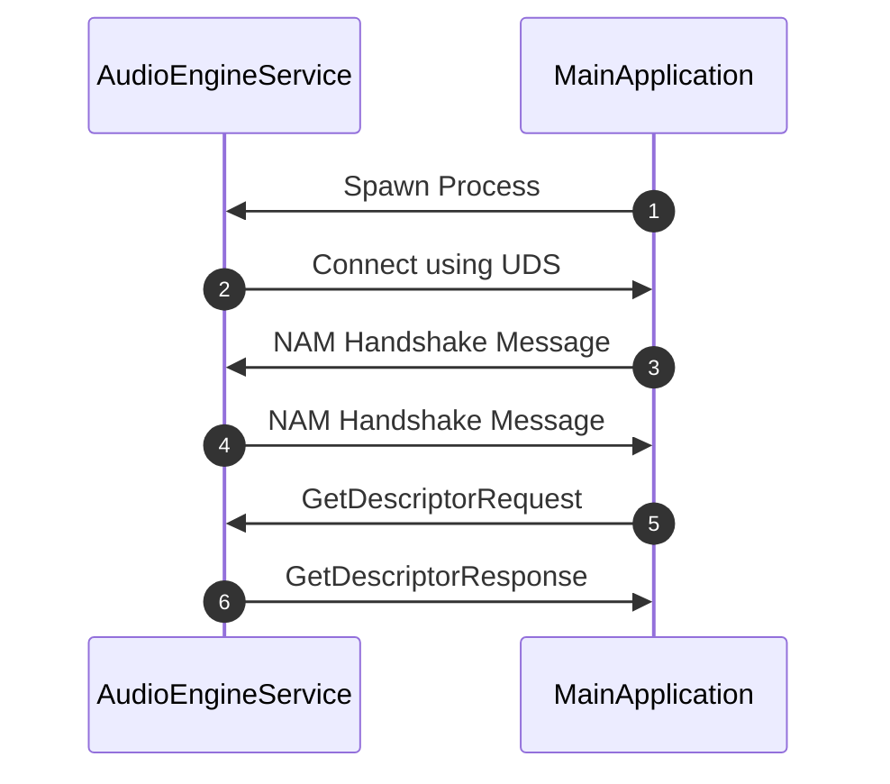
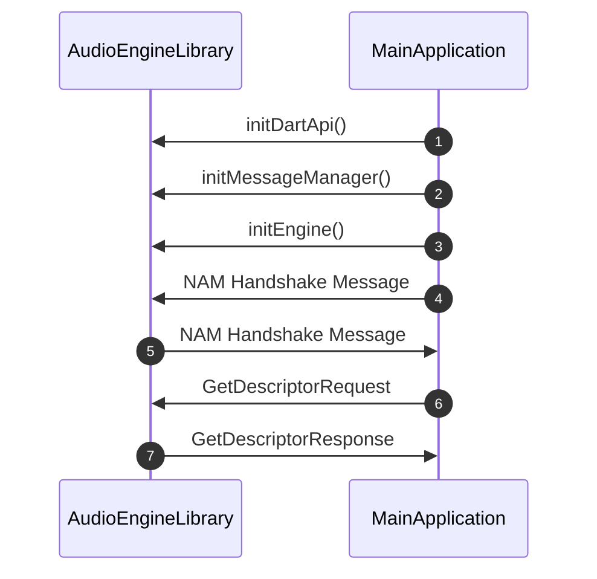
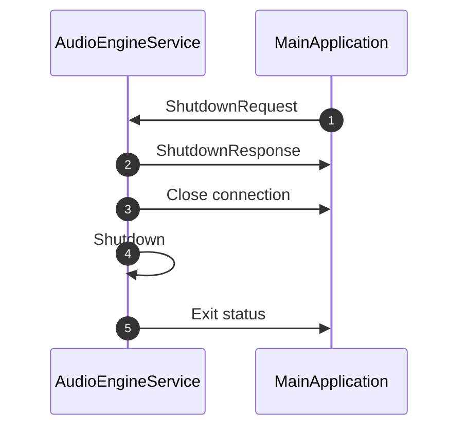
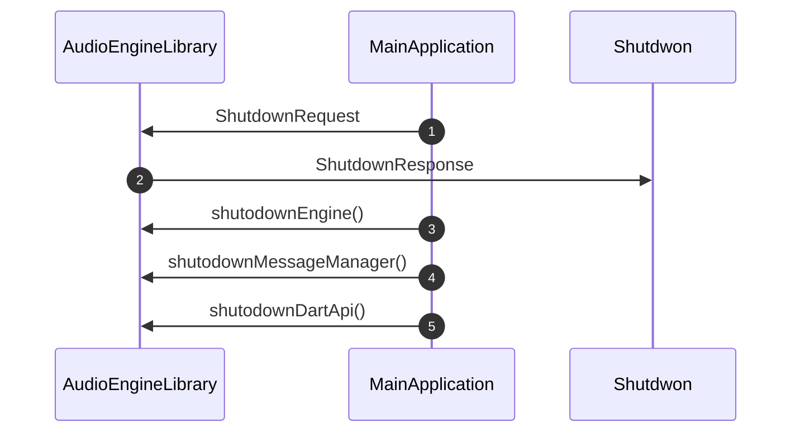

# Initialization

## AudioEngineService

```mermaid
sequenceDiagram
    autonumber
    participant Engine as AudioEngineService
    participant App as MainApplication
    App ->> Engine: Spawn Process # Passing UDS file path as a command line argument.
    Engine ->> App: Connect using UDS
    App ->> Engine: NAM Handshake Message
    Engine ->> App: NAM Handshake Message
    App ->> Engine: GetDescriptorRequest
    Engine ->> App: GetDescriptorResponse
```

## AudioEngineLibrary

```mermaid
sequenceDiagram
    autonumber
    participant Engine as AudioEngineLibrary
    participant App as MainApplication
    App ->> Engine: initDartApi()
    App ->> Engine: initMessageManager()
    App ->> Engine: initEngine()
    App ->> Engine: NAM Handshake Message
    Engine ->> App: NAM Handshake Message
    App ->> Engine: GetDescriptorRequest
    Engine ->> App: GetDescriptorResponse
```

# Shutdown

## AudioEngineService

今は雑に kill しているが、将来的には以下のようにしたい。

```mermaid
sequenceDiagram
    autonumber
    participant Engine as AudioEngineService
    participant App as MainApplication
    App ->> Engine: ShutdownRequest
    Engine ->> App: ShutdownResponse
    Engine ->> App: Close connection
    Engine ->> Engine: Shutdown
    Engine ->> App: Exit status
```

## AudioEngineLibrary

ShutdownRequest は未実装。

```mermaid
sequenceDiagram
    autonumber
    participant Engine as AudioEngineLibrary
    participant App as MainApplication
    App ->> Engine: ShutdownRequest
    Engine ->> Shutdwon: ShutdownResponse
    App ->> Engine: shutodownEngine()
    App ->> Engine: shutodownMessageManager()
    App ->> Engine: shutodownDartApi()
```
