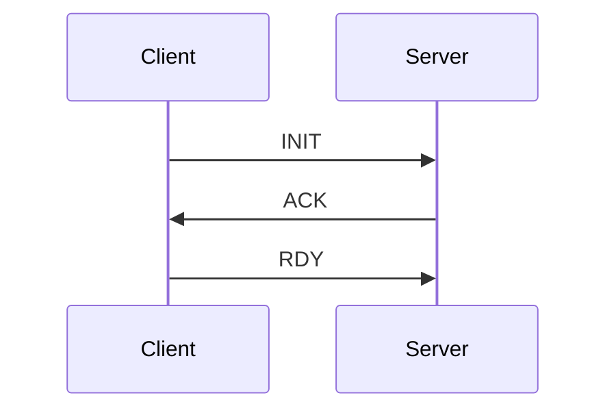

# NAM (NovoNotes App Messaging)

## 目的

NAM (NovoNotes App Messaging) は NovoNotes の製品や OSS で共通して用いられる、コンポーネント間のメッセージのプロトコルである。
このプロトコルは、現在や将来の、NovoNotes のアプリケーションにおいての実用性の確保を目的として策定されている。
具体的には、以下の点を考慮しつつ、大部分の NovoNotes アプリケーションに共通して必要になる、基本的なメッセージプロトコルを定義している。

- 幅広い転送方式との互換性
- メッセージのコンテンツに対する柔軟性・拡張性

## 想定するユースケース

- FFI を用いた言語間メッセージング
- Unix Domain Socket 等の IPC
- 同一ネットワーク内のデバイス間通信

## Message の形式

Message は Header と Body によって構成される。

### Header

Header は 13 バイトの固定長バッファ "Descriptor" と、可変長バッファ "Context" で構成される。

Descriptor:

- 先頭の 1 バイトはプロトコルの Version。
- 続く 2 バイトは session id を表す uint16 のデータ。
- 続く 2 バイトは body type。body のデータ型を表す識別子で、body を deserialize するときのヒントとして用いることができる。uint16 のデータ。
- 続く 4 バイトは context size。context のバイトサイズを表す uint32 のデータ。
- 続く 4 バイトは body size。body のバイトサイズを表す uint32 のデータ。

Context:

- Descriptor で指定された context size 分の context のバッファ。内容はアプリケーションごとに規定される。

Byte order は big endian。

### Body

Body のメッセージ形式については、NAM では規定しない。それぞれのアプリケーションごとに規定する。

## 特殊なメッセージ

### ハンドシェイクメッセージ

目的:

- このハンドシェイクは、TCP での接続確立後の初期化・状態復元や、UDP での接続確認などに用いることができる。
- 主にセッション ID の同期を目的としている。
- このハンドシェイクを行うかどうかは、各 API 設計者が決定できる。ハンドシェイクの有無は、各 API ドキュメントに記載するべき。

詳細:



1. **INIT**: Initialize の略。クライアント側からサーバー側への最初のメッセージとして INIT を送る。既存のセッションの継続をリクエストする場合は、その セッション ID を用いる。新規セッションをリクエストする場合は、セッション ID 0 を用いる。
2. **ACK**: Acknowledge の略。サーバー側はリクエストとして受け取ったセッションID を元に、実際に用いるセッションを決定する。セッションを継続可能な場合は、その ID 用いて ACK メッセージを返す。新規セッションの場合は、新しい ID を生成して、ACK メッセージを送る。
3. **RDY**: Ready の略。クライアント側はサーバーから受け取ったセッション ID を用いて今後のメッセージの送受信を行わなければいけない。送受信の準備が完了したら Ready メッセージを送る。サーバーはこのメッセージを受け取るまで、他のメッセージの送信を待機する。

ハンドシェイクのメッセージはすべて body type 0 を用いる。また context, body ともに空とする。

## v2 仕様変更案

Context はアプリケーションごとにプロトコルを決めて送った方が良さそう。nam の範囲外の方がいい気がする。
以下はアプリケーション側のプロトコルの例。これをセリアライズして nam の body に入れる。

```protobuf
message Request {
    string methodPath = 1;
    google.protobuf.Struct context = 2;
    bytes body = 3;
}
```
