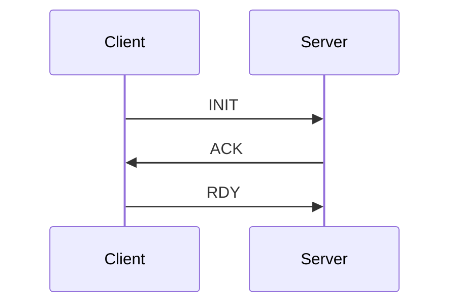

# NAM (NovoNotes App Messaging)

## Purpose

NAM (NovoNotes App Messaging) is a protocol for messaging between components commonly used in NovoNotes products and OSS.
This protocol is formulated with the aim of ensuring practicality in current and future NovoNotes applications.
Specifically, it defines a basic messaging protocol commonly required for most NovoNotes applications, while considering the following points:

- Compatibility with a wide range of transfer methods
- Flexibility and extensibility for message content

## Expected Use Cases

- Inter-language messaging using FFI
- IPC such as Unix Domain Socket
- Communication between devices within the same network

## Message Format

A Message consists of a Header and a Body.

### Header

The Header consists of a 13-byte fixed-length buffer "Descriptor" and a variable-length buffer "Context".

Descriptor:

- The first 1 byte is the protocol Version.
- The following 2 bytes are uint16 data representing the session id.
- The following 2 bytes are the body type. An identifier representing the data type of the body, which can be used as a hint when deserializing the body. uint16 data.
- The following 4 bytes are the context size. uint32 data representing the byte size of the context.
- The following 4 bytes are the body size. uint32 data representing the byte size of the body.

Context:

- Context buffer of the context size specified in the Descriptor. The content is defined for each application.

Byte order is big endian.

### Body

The message format of the Body is not specified by NAM. It is defined for each application.

## Special Messages

### Handshake Message

Purpose:

- This handshake can be used for initialization/state restoration after establishing a TCP connection, or for connection confirmation with UDP.
- The main purpose is to synchronize session IDs.
- Whether to perform this handshake can be decided by each API designer. The presence or absence of handshake should be documented in each API documentation.

Details:



1. **INIT**: Abbreviation for Initialize. The client sends INIT as the first message to the server. When requesting continuation of an existing session, use that session ID. When requesting a new session, use session ID 0.
2. **ACK**: Abbreviation for Acknowledge. The server determines the actual session to use based on the session ID received as a request. If the session can be continued, it returns an ACK message using that ID. For a new session, it generates a new ID and sends an ACK message.
3. **RDY**: Abbreviation for Ready. The client must use the session ID received from the server for future message transmission and reception. When ready for transmission and reception, send a Ready message. The server waits to send other messages until it receives this message.

All handshake messages use body type 0. Both context and body are empty.

## v2 Specification Change Proposal

It seems better to send Context with a protocol determined for each application. It feels like it should be outside the scope of nam.
Below is an example of an application-side protocol. This is serialized and put in the nam body.

```protobuf
message Request {
    string methodPath = 1;
    google.protobuf.Struct context = 2;
    bytes body = 3;
}
```