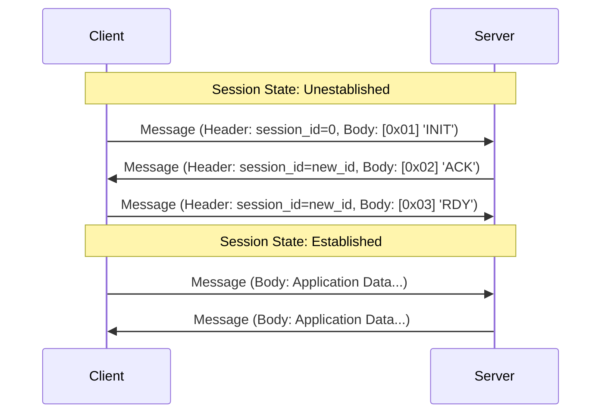

# NSP (NovoNotes Session Protocol) v1 仕様書

## 1. はじめに (Introduction)

### 1.1. 概要 (Overview)

NSP (NovoNotes Session Protocol) v1は、DAW（Digital Audio Workstation）やオーディオプラグインなど、コンポーネント間の通信セッションを効率的に確立・管理するために設計された、軽量なバイナリプロトコルです。

本プロトコルは、クライアントとサーバー間で一意のセッションIDを同期し、以降の持続的なメッセージ交換のための論理的なコンテキストを提供することに特化しています。

### 1.2. 設計思想 (Design Philosophy)

NSPは、シンプルさと責務の単一性を重視しており、以下の2つの原則に基づいています。

1.  **セッションIDの同期に特化**: NSPの唯一の責務は、2つのエンドポイント間で一意の `session_id` を同期し、論理的なセッションを確立することです。
2.  **ペイロードへの完全な透過性**: NSPは、メッセージの `Body`（ペイロード）の内容を一切関知せず、その解釈を完全に上位レイヤーのアプリケーションに委ねます。

この設計により、NSPは特定のアプリケーションデータに依存することなく、多様な上位プロトコルのための基盤として機能します。

### 1.3. 想定ユースケース (Intended Use Cases)

- FFI (Foreign Function Interface) を用いた異なるプログラミング言語間のメッセージング
- Unix Domain Socketや名前付きパイプ等を利用したプロセス間通信 (IPC)
- 同一ローカルネットワーク内のデバイス間通信

### 1.4. 用語定義 (Terminology)

- **クライアント (Client)**: セッションの確立を開始するエンドポイント。
- **サーバー (Server)**: セッション確立要求を受け付け、応答するエンドポイント。
- **セッション (Session)**: `session_id` によって一意に識別される、クライアントとサーバー間の論理的な通信コンテキスト。
- **メッセージ (Message)**: `Header` と `Body` から構成される、本プロトコルにおける通信の基本単位。

## 2. プロトコル仕様 (Protocol Specification)

### 2.1. メッセージ構造 (Message Structure)

#### 2.1.1. 全体構成 (Overall Structure)

メッセージは、7バイトの固定長 `Header` と、可変長の `Body` から構成されます。

```
+------------------+--------------------------+
|      Header      |           Body           |
+------------------+--------------------------+
|     7 bytes      |    body_size bytes       |
+------------------+--------------------------+
```

#### 2.1.2. ヘッダー (Header)

ヘッダーは、以下の3つのフィールドで構成されます。

```
+-------------+-----------------+----------------+
|   version   |   session_id    |   body_size    |
+-------------+-----------------+----------------+
|   1 byte    |     2 bytes     |     4 bytes    |
|    uint8    |      uint16     |      uint32    |
+-------------+-----------------+----------------+
```

- **`version`**: プロトコルのバージョンを示す `uint8` 型の整数。本仕様書では `0x01`。
- **`session_id`**: セッションを識別する `uint16` 型の整数。
- **`body_size`**: 後続する `Body` フィールドのバイト長を示す `uint32` 型の整数。

#### 2.1.3. ボディ (Body)

`Header` の `body_size` で指定された長さを持つオクテット列です。NSPは `Body` の内容を解釈しません。セッション確立後のデータフォーマットは、すべて上位レイヤーの責務となります。

#### 2.1.4. バイトオーダー (Byte Order)

すべての多バイト整数値（`session_id`, `body_size`）は、**ネットワークバイトオーダー（ビッグエンディアン）** でエンコードする必要があります。

### 2.2. セッション確立 (ハンドシェイク) (Session Establishment - Handshake)

#### 2.2.1. 概要 (Overview)

通信の開始に先立ち、クライアントとサーバーは3ウェイハンドシェイクを行い、一意のセッションIDを共有することでセッションを確立します。

#### 2.2.2. ハンドシェイクメッセージ (Handshake Messages)

ハンドシェイク中、メッセージは `body_size` が `1` であり、`Body` には1バイトのコマンドIDが含まれます。

| コマンド | 値 (Hex) | `body_size` |    送信者    | 説明                                                         |
| :------: | :------: | :---------: | :----------: | :----------------------------------------------------------- |
|  `INIT`  |  `0x01`  |      1      | クライアント | セッション確立または再開を要求する                           |
|  `ACK`   |  `0x02`  |      1      |   サーバー   | セッションIDを承認・通知する                                 |
|  `RDY`   |  `0x03`  |      1      | クライアント | サーバーが指定したセッションIDの準備が完了したことを通知する |

#### 2.2.3. 通信シーケンス (Communication Sequence)

##### 2.2.3.1. 新規セッション確立 (New Session Establishment)

1.  **Client → Server**: クライアントは `Header` の `session_id` を `0` に設定し、`Body` に `[0x01]` (`INIT`) を格納したメッセージを送信します。
2.  **Server → Client**: サーバーは `INIT` を受信後、`0` 以外のユニークな `session_id` を新たに割り当てます。そのIDを `Header` に設定し、`Body` に `[0x02]` (`ACK`) を格納したメッセージを返信します。
3.  **Client → Server**: クライアントは `ACK` を受信後、サーバーから指定された `session_id` を `Header` に設定し、`Body` に `[0x03]` (`RDY`) を格納したメッセージを送信します。
4.  サーバーが `RDY` メッセージを受信した時点で、セッションは「確立済み」状態となります。

##### 2.2.3.2. セッション再開 (Session Resumption)

1.  **Client → Server**: クライアントは再開したいセッションの `session_id` (≠0) を `Header` に設定し、`Body` に `[0x01]` (`INIT`) を格納したメッセージを送信します。
2.  **Server → Client**: サーバーは `INIT` を受信後、以下のように応答します。
    - 要求された `session_id` が有効な（再開可能な）場合: 同一の `session_id` を `Header` に設定し、`ACK` を返信します。
    - 要求された `session_id` が無効な（存在しない、または期限切れの）場合: 新規セッション確立時と同様に、新たな `session_id` を割り当てて `ACK` を返信します。
3.  以降の手順は、新規セッション確立のステップ3以降と同様です。

#### 2.2.4. シーケンス図 (Sequence Diagram)



## 3. 実装上の考慮事項 (Implementation Considerations)

### 3.1. エラー処理 (Error Handling)

以下の条件に合致するメッセージは不正とみなされ、受信側は通知や応答を行うことなく、そのメッセージを破棄しなければなりません (MUST be discarded)。

1.  **不正なバージョン**: `Header` の `version` フィールドが `0x01` ではない。
2.  **不正なハンドシェイクメッセージ**:
    - セッションが**未確立**の状態で、`body_size` が `1` であるにもかかわらず、`Body` の内容が期待されるコマンド (`INIT`, `ACK`, `RDY` のいずれか) ではない。
    - `session_id` が `0` の `ACK` または `RDY` メッセージを受信した。

### 3.2. 制約事項 (Constraints)

- `session_id = 0` は、新規セッション確立要求のために予約された特別な値です。確立済みのセッションでこのIDを使用してはなりません (MUST NOT)。
- `body_size` が取りうる最大値は、本仕様書では定義せず、実装に依存します。

### 3.3. セッションライフサイクル (Session Lifecycle)

本プロトコルは、セッションを明示的に終了するための手順や、その有効期間（ライフタイム）を**意図的に定義しません**。セッションのライフサイクル管理は上位アプリケーションの責務です。

実装者は、自身のアプリケーションの要件（例: DAWのプロジェクトが開かれている間、特定のプロセスが生存している間など）に基づき、セッションのライフサイクルを管理する必要があります。

### 3.4. ハンドシェイクタイムアウト (Handshake Timeout)

安定した接続処理のため、ハンドシェイクの各ステップにおいてタイムアウト機構を実装することを**強く推奨します (STRONGLY RECOMMENDED)**。これにより、応答のない通信試行によってリソースがロックされることを防ぎます。

- **タイムアウトを考慮すべき状況**:
  1.  クライアントが `INIT` を送信後、サーバーからの `ACK` を待つ間。
  2.  サーバーが `ACK` を送信後、クライアントからの `RDY` を待つ間。
- **推奨値**: タイムアウトは **5秒** 程度を推奨します。
- **タイムアウト後の処理**: タイムアウトが発生した場合、そのハンドシェイク試行は失敗とみなし、確保した一時的なリソースを解放します。
