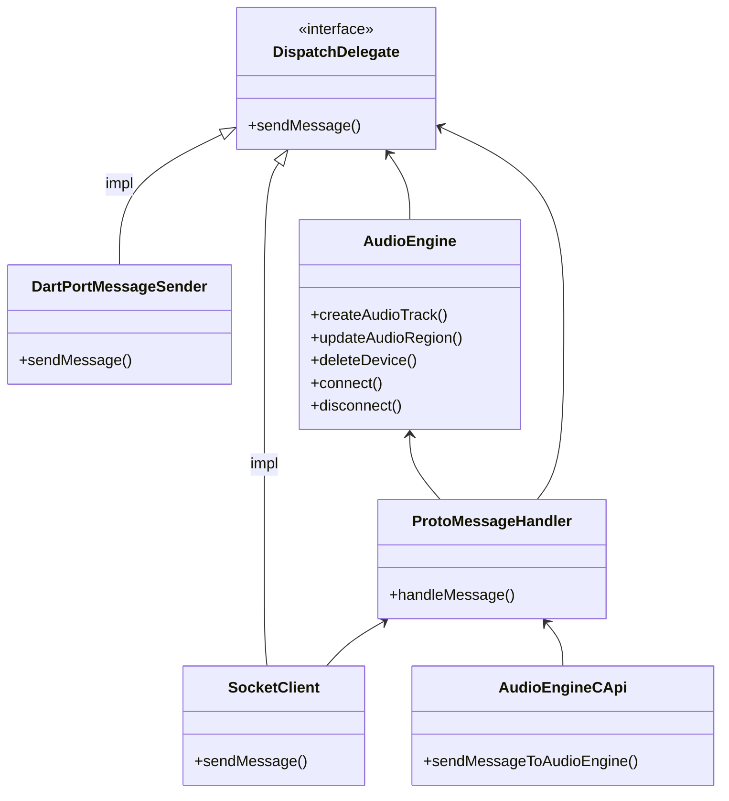

# Class Diagram

```mermaid
classDiagram
    DispatchDelegate <|-- DartPortMessageSender: impl
    DispatchDelegate <|-- SocketClient: impl
    ProtoMessageHandler <-- SocketClient
    AudioEngine <-- ProtoMessageHandler
    DispatchDelegate <-- ProtoMessageHandler
    DispatchDelegate <-- AudioEngine
    ProtoMessageHandler <-- AudioEngineCApi
    class SocketClient{
        +sendMessage()
    }
    class ProtoMessageHandler{
        +handleMessage()
    }
    class AudioEngine{
        +createAudioTrack()
        +updateAudioRegion()
        +deleteDevice()
        +connect()
        +disconnect()
    }
    class AudioEngineCApi {
        +sendMessageToAudioEngine()
    }
    class DartPortMessageSender{
        +sendMessage()
    }
    class DispatchDelegate{
        <<interface>>
        +sendMessage()
    }
```
