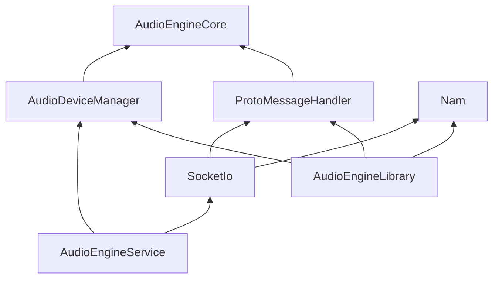

# AudioEngine Cpp

## Building from Source

### 1. Prerequisite

- (Windows の場合) Git Bash を使ってください。
- CMake の install `brew install cmake`
- [grpc-installer で GRPC のインストール](../../Docs/grpc-installation.md)
- `NOVONOTES_DUO_FLUTTER_SDK_DIR` の環境変数の設定
  - **推奨: FVM（Flutter Version Management）を使用する場合**
    - Git リポジトリルートからのパスを使用: `export NOVONOTES_DUO_FLUTTER_SDK_DIR=$(git rev-parse --show-toplevel)/.fvm/versions/3.29.1`
    - または絶対パスで指定: `export NOVONOTES_DUO_FLUTTER_SDK_DIR=/path/to/your/project/.fvm/versions/3.29.1`
  - FVMを使用しない場合は `flutter doctor -v` で表示されるFlutterのインストールパスを指定してください

### 2. Build

各プラットフォームごとに以下の手順でビルドしてください。

#### macOS

```sh
# Configure for macOS
cmake -B build -G Xcode
# Build
cmake --build build
```

#### Windows

```sh
# Configure
cmake -B build -G "Visual Studio 17 2022" -A x64
# Build
cmake --build build
```

#### Linux

```sh
# Configure
cmake -B build -G "Unix Makefiles"
# Build
cmake --build build
```

#### iOS

```sh
# Configure for iOS
cmake -B build -G Xcode -DCMAKE_SYSTEM_NAME=iOS
```

build 以下に .xcodeproj ファイルが生成されます。
Xcode でターゲットのデバイスやアーキテクチャを設定してビルドしてください。
iOS向けのビルドはmacOS上のみ可能です。

## Modules

### Overview

- **AudioEngineCore**: 音声処理、シーケンサー、オーディオグラフなどの Audio Engine の主要機能の実装。
- **AudioDeviceManager**: Audio Device の繋ぎ込みのためのコード。
- **ProtoMessageHandler**: アプリケーションから受け取った Protobuf のメッセージの処理。
- **Nam**: Nam プロトコルの実装。Nam については、[nam.md](../doc/nam.md) 参照。
- **SocketIo**: UDP Socket や UDS などのソケットを用いた、 Audio Engine のインターフェースの実装。

### Dependency Graph

Dependency graph of the modules.



## Contributing

コードに手を加えようとするコントリビューターやメンテナーは、[contributing.md](./contributing.md) を必ず読んでください。
